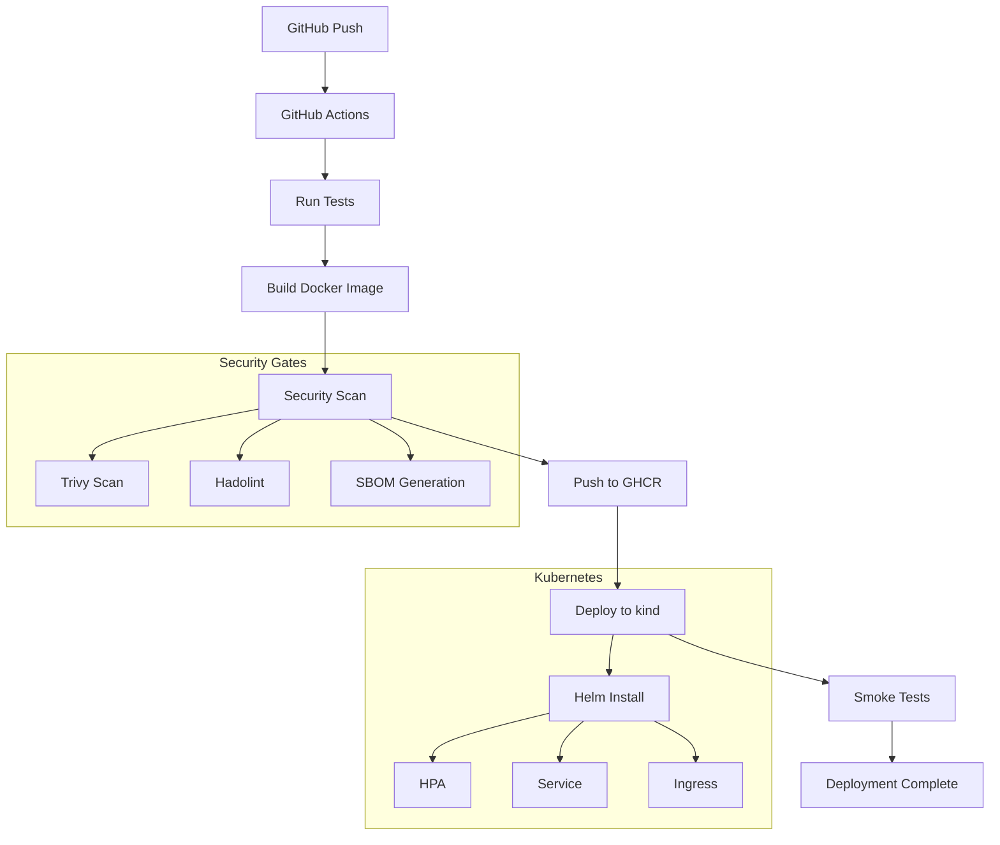

# 🐳 Microservice K8s Demo

Production-ready Python Flask microservice demonstrating cloud-native best practices with Kubernetes, Helm, and complete CI/CD automation.

[](https://github.com/username/microservice-k8s-demo/actions/workflows/ci.yml)
[](https://github.com/username/microservice-k8s-demo/actions/workflows/security.yml)
[](./Dockerfile)
[](./helm/microservice)
[](LICENSE)

## 📋 Overview

This project showcases a production-grade Python microservice with:
- **Multi-stage Docker builds** for optimized images
- **Kubernetes deployment** via Helm charts with best practices
- **Complete CI/CD pipeline** with testing, scanning, and automated deployment
- **Security-first approach** with vulnerability scanning and policy enforcement
- **Observability** with structured logging and health endpoints

**⚠️ Privacy Notice:** This is a demo project using ephemeral kind clusters in CI. No production data or credentials are exposed.

## 🏗️ Architecture



## 🚀 Features

### Application
- ✅ **Flask REST API** with versioned endpoints
- ✅ **Health checks** (liveness & readiness probes)
- ✅ **Structured JSON logging** with correlation IDs
- ✅ **OpenAPI/Swagger** documentation
- ✅ **Graceful shutdown** with signal handling
- ✅ **Metrics endpoint** for Prometheus

### Docker
- ✅ **Multi-stage build** (builder + runtime)
- ✅ **Non-root user** for security
- ✅ **Minimal base image** (python:3.11-slim)
- ✅ **Layer optimization** for caching
- ✅ **Health check** defined in Dockerfile
- ✅ **Security scanning** with Trivy & Hadolint

### Kubernetes/Helm
- ✅ **Deployment** with rolling updates
- ✅ **Service** (ClusterIP)
- ✅ **HorizontalPodAutoscaler** for auto-scaling
- ✅ **PodDisruptionBudget** for availability
- ✅ **Resource limits** and requests
- ✅ **Security context** (non-root, read-only FS)
- ✅ **Liveness & Readiness probes**
- ✅ **NetworkPolicy** for pod isolation
- ✅ **ConfigMap** for configuration
- ✅ **Secret** management

### CI/CD
- ✅ **Automated testing** with pytest and coverage
- ✅ **Code quality** checks (black, flake8, isort)
- ✅ **Security scanning** (Trivy, Bandit, Gitleaks)
- ✅ **Docker build** with multi-arch support
- ✅ **Helm validation** (lint, kubeconform, OPA)
- ✅ **Deployment to kind** with smoke tests
- ✅ **Artifact management** (GHCR)

## 📁 Project Structure

```
microservice-k8s-demo/
├── .github/
│   └── workflows/
│       ├── ci.yml                 # Main CI/CD pipeline
│       └── security.yml           # Security scanning
├── app/
│   ├── __init__.py
│   ├── main.py                    # Flask application
│   ├── config.py                  # Configuration management
│   ├── logger.py                  # Structured logging
│   └── routes/
│       ├── __init__.py
│       ├── health.py              # Health check endpoints
│       └── api.py                 # API endpoints
├── tests/
│   ├── __init__.py
│   ├── test_health.py            # Health endpoint tests
│   ├── test_api.py               # API endpoint tests
│   └── conftest.py               # pytest configuration
├── helm/
│   └── microservice/
│       ├── Chart.yaml
│       ├── values.yaml
│       ├── values-dev.yaml
│       ├── values-prod.yaml
│       └── templates/
│           ├── deployment.yaml
│           ├── service.yaml
│           ├── hpa.yaml
│           ├── pdb.yaml
│           ├── configmap.yaml
│           ├── networkpolicy.yaml
│           └── _helpers.tpl
├── Dockerfile                     # Multi-stage Docker build
├── .dockerignore
├── requirements.txt               # Python dependencies
├── requirements-dev.txt           # Development dependencies
├── pytest.ini                     # pytest configuration
├── .gitignore
├── LICENSE
└── README.md
```

## 🛠️ Technology Stack

| Category | Tools |
|----------|-------|
| **Language** | Python 3.11 |
| **Framework** | Flask 3.0 |
| **Container** | Docker 24+ |
| **Orchestration** | Kubernetes 1.28, Helm 3.13 |
| **Testing** | pytest, pytest-cov, pytest-flask |
| **CI/CD** | GitHub Actions |
| **Security** | Trivy, Hadolint, Bandit, Gitleaks |
| **Quality** | Black, Flake8, isort |
| **Registry** | GitHub Container Registry (GHCR) |

## 🏃 Quick Start

### Prerequisites
- Docker Desktop
- kubectl
- Helm 3.x
- Python 3.11+

### Run Locally with Docker

```bash
# Clone the repository
git clone https://github.com/username/microservice-k8s-demo.git
cd microservice-k8s-demo

# Build the Docker image
docker build -t microservice:local .

# Run the container
docker run -p 8080:8080 microservice:local

# Test the application
curl http://localhost:8080/health
curl http://localhost:8080/api/v1/hello
```

### Run Locally with Python

```bash
# Create virtual environment
python -m venv venv
source venv/bin/activate  # On Windows: venv\Scripts\activate

# Install dependencies
pip install -r requirements.txt
pip install -r requirements-dev.txt

# Run the application
python -m app.main

# In another terminal, test it
curl http://localhost:8080/health
```

### Deploy to kind (Local Kubernetes)

```bash
# Create kind cluster
kind create cluster --name microservice-demo

# Build and load image into kind
docker build -t microservice:dev .
kind load docker-image microservice:dev --name microservice-demo

# Deploy with Helm
helm install microservice ./helm/microservice \
  --set image.repository=microservice \
  --set image.tag=dev \
  --values ./helm/microservice/values-dev.yaml

# Port forward to access
kubectl port-forward svc/microservice 8080:80

# Test
curl http://localhost:8080/health
```

## 🧪 Testing

### Run Unit Tests

```bash
# Install test dependencies
pip install -r requirements-dev.txt

# Run all tests with coverage
pytest --cov=app --cov-report=html --cov-report=term

# Run specific test file
pytest tests/test_health.py -v

# Open coverage report
open htmlcov/index.html  # On Mac
```

### Run Integration Tests

```bash
# Start the application
python -m app.main &

# Run integration tests
pytest tests/ -m integration

# Stop the application
kill %1
```

## 🔒 Security

### Security Features
- **Non-root container** execution
- **Read-only root filesystem**
- **Resource limits** to prevent DoS
- **Network policies** for pod isolation
- **Secret management** via Kubernetes secrets
- **Regular vulnerability scanning**
- **No hardcoded credentials**

### Security Scanning

```bash
# Scan Dockerfile
docker run --rm -i hadolint/hadolint < Dockerfile

# Scan image with Trivy
trivy image microservice:local

# Scan code with Bandit
bandit -r app/

# Check for secrets
docker run --rm -v $(pwd):/code zricethezav/gitleaks:latest detect --source /code
```

## 📊 Monitoring & Observability

### Health Endpoints

```bash
# Liveness probe (is app running?)
curl http://localhost:8080/health/live

# Readiness probe (is app ready for traffic?)
curl http://localhost:8080/health/ready

# Startup probe
curl http://localhost:8080/health/startup
```

### Metrics

```bash
# Prometheus metrics
curl http://localhost:8080/metrics
```

### Logs

Application uses structured JSON logging:
```json
{
  "timestamp": "2024-01-15T10:30:45.123Z",
  "level": "INFO",
  "correlation_id": "abc-123-def",
  "message": "Request processed",
  "method": "GET",
  "path": "/api/v1/hello",
  "status": 200,
  "duration_ms": 12.5
}
```

## 🚀 CI/CD Pipeline

### Workflow Stages

1. **Test** - Run unit tests with coverage
2. **Lint** - Code quality checks (black, flake8, isort)
3. **Security Scan** - Vulnerability scanning (Trivy, Bandit)
4. **Build** - Multi-stage Docker build
5. **Image Scan** - Container security (Trivy, Hadolint)
6. **Push** - Upload to GHCR (on main branch)
7. **Helm Validate** - Chart linting and validation
8. **Deploy** - Install to kind cluster
9. **Smoke Test** - Verify deployment health
10. **Cleanup** - Tear down ephemeral resources

### Trigger Workflows

```bash
# Automatic triggers
git push                    # Runs on push to any branch
git push origin main        # Runs full pipeline + deployment

# Manual trigger via GitHub UI
# Go to Actions → Select workflow → Run workflow
```

## 📈 Scaling

### Horizontal Pod Autoscaler

The HPA automatically scales based on CPU/memory:

```yaml
# Configured in values.yaml
autoscaling:
  enabled: true
  minReplicas: 2
  maxReplicas: 10
  targetCPUUtilizationPercentage: 70
  targetMemoryUtilizationPercentage: 80
```

### Manual Scaling

```bash
# Scale to 5 replicas
kubectl scale deployment microservice --replicas=5

# Or update via Helm
helm upgrade microservice ./helm/microservice --set replicaCount=5
```

## 🔧 Configuration

### Environment Variables

| Variable | Description | Default |
|----------|-------------|---------|
| `APP_NAME` | Application name | `microservice` |
| `LOG_LEVEL` | Logging level | `INFO` |
| `PORT` | Server port | `8080` |
| `WORKERS` | Gunicorn workers | `4` |
| `TIMEOUT` | Request timeout | `30` |

### Helm Values

Key configuration options in `values.yaml`:

```yaml
replicaCount: 2
image:
  repository: ghcr.io/username/microservice
  tag: latest
  pullPolicy: IfNotPresent

resources:
  requests:
    cpu: 100m
    memory: 128Mi
  limits:
    cpu: 500m
    memory: 512Mi

autoscaling:
  enabled: true
  minReplicas: 2
  maxReplicas: 10
```

## 🐛 Troubleshooting

### Pod Not Starting?

```bash
# Check pod status
kubectl get pods

# View pod logs
kubectl logs -l app=microservice --tail=50

# Describe pod for events
kubectl describe pod <pod-name>

# Check resource usage
kubectl top pods
```

### Service Not Accessible?

```bash
# Verify service
kubectl get svc microservice

# Test service internally
kubectl run -it --rm debug --image=busybox --restart=Never -- wget -O- http://microservice/health

# Check endpoints
kubectl get endpoints microservice
```

### Image Pull Errors?

```bash
# Check image pull secret
kubectl get secret regcred

# Verify image exists
docker pull ghcr.io/username/microservice:tag

# Check GHCR permissions
```

## 📚 API Documentation

### Endpoints

| Method | Endpoint | Description | Response |
|--------|----------|-------------|----------|
| GET | `/health` | Basic health check | `200 OK` |
| GET | `/health/live` | Liveness probe | `200 OK` |
| GET | `/health/ready` | Readiness probe | `200 OK` |
| GET | `/health/startup` | Startup probe | `200 OK` |
| GET | `/metrics` | Prometheus metrics | Metrics data |
| GET | `/api/v1/hello` | Hello endpoint | JSON response |
| GET | `/api/v1/status` | Service status | JSON response |

### Example Requests

```bash
# Hello endpoint
curl http://localhost:8080/api/v1/hello
# Response: {"message": "Hello from microservice!", "version": "1.0.0"}

# Status endpoint
curl http://localhost:8080/api/v1/status
# Response: {"status": "healthy", "uptime": "1h 23m 45s"}
```

## 🤝 Contributing

This is a demo portfolio project, but improvements are welcome!

1. Fork the repository
2. Create a feature branch
3. Make your changes
4. Run tests and linting
5. Submit a pull request

## 📄 License

MIT License - See [LICENSE](LICENSE) file for details

## 🎓 Learning Resources

- [Kubernetes Best Practices](https://kubernetes.io/docs/concepts/configuration/overview/)
-
